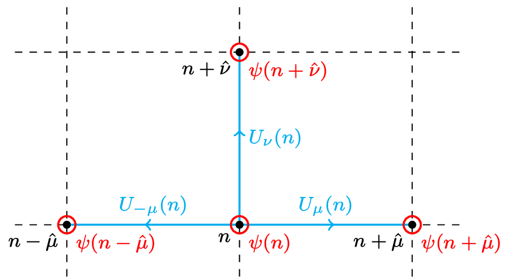

# Covariant Approximation Averaging for MCMC correlator data

This repository demonstrates the use of **Covariant Approximation Averaging (CAA)** (see e.g. [Blum et al. (2012)](https://arxiv.org/pdf/1208.4349), [Shintani et al. (2014)](https://arxiv.org/abs/1402.0244)) to **real-world Lattice QCD correlator data** obtained from **Markov Chain Monte Carlo (MCMC)** simulations used in my [PhD thesis](http://doi.org/10.5283/epub.76831).
It includes a jupyter notebook ([view here](https://github.com/spieseba/correlatorCAA/blob/main/CAA.ipynb)) with visualizations and also serves as a practical example application for the [`statpy`](https://github.com/spieseba/statpy) library.

The folllowing provides a brief introduction to Lattice QCD and the CAA techique.

---

## 📚 Basics of Lattice QCD
Lattice quantum chromodynamics (QCD) is the standard non-perturbative framework for studying the strong nuclear force. In this section, we briefly introduce the essential ingredients, focusing on aspects relevant to simulation and data analysis.

It is defined on a discretized Euclidean spacetime lattice with spacing $a$. The mathematical guiding principle for constructing the action of such a theory is to require gauge invariance under local SU(3) transformations. The Lattice QCD action is:

$$S[\psi,\overline{\psi},U] = S_F[\psi,\overline{\psi},U] + S_G[U]$$
- $S_F$: fermionic part, encoding (anti-)quark fields $\psi, \overline{\psi}$
- $S_G$: gluonic part, governing the gauge fields $U$ (gluons)

The fermionic fields live on **lattice sites**, while the gluonic fields are defined on the **links** connecting them:

  

### 🧮 Path Integral Formulation

Physical observables are computed as **path integrals** over gauge fields $U$:

$$ \langle O \rangle = \frac{1}{Z}\int\mathcal{D}[U] O[U] e^{-S_G[U]}\prod_f\det[D_f],$$

where:
- $O[U]$ is a parametrization of the observable in terms of gauge fields
- $\det[D_f]$ arises from integrating out fermionic degrees of freedom
- $Z$ is the normalization constant (partition function):

$$ Z = \int \mathcal{D}[\psi,\overline{\psi}] \mathcal{D}[U] \, e^{-S[\psi,\overline{\psi},U]} $$

These integrals are evaluated **numerically** using MCMC methods. A set of $N_\text{conf}$ gauge field configurations $U_1, \dots, U_{N_\text{conf}}$ is sampled from the probability distribution:

$$ P[U] \propto e^{-S_G[U]} \prod_f \det[D_f] $$

and the observable is estimated as the **ensemble average**:

$$
  \langle O \rangle = \frac{1}{N_\text{conf}}\sum_{i=1}^{N_\text{conf}} O[U_i] + \mathcal{O}\left(\frac{1}{\sqrt{N_\text{conf}}}\right),
$$

where the error scales with $1/\sqrt{N_\text{conf}}$ due to the central limit theorem and $N_\text{conf}$ is typically of the order 100 - 1000.

---

## 🎯 Correlation Functions
An especially important class of observables in Lattice QCD are **two-point correlation functions**. They quantify how strongly **quantum fluctuations** at two spacetime points are correlated. Physically, they represent the amplitude to **create a hadron** at one spacetime point and **annihilate it** at another. From their behavior, we can extract key properties of **hadrons**, particles composed of quarks, such as their **masses** and **decay constants**.

Mathematically, two-point correlation functions decay **exponentially** with increasing Euclidean time separation $t$:

$$ 
C(t) \sim e^{- t m_H} \left(1 + \mathcal{O}(e^{-t \Delta E})\right), 
$$

where:
- $m_H$ is the ground state mass of the hadron $H$
- $\Delta E$ denotes the energy gap to the first excited state

At sufficiently large time separations, the excited-state contributions are suppressed, and the **ground state dominates**. This enables the extraction of $m_H$, typically via exponential fits to the correlator.

---

## ⚙️ Computational challenge
Both the **generation of gauge field configurations** and the **computation of correlation functions** in Lattice QCD are computationally intensive tasks.

The primary bottleneck in both steps is the inversion of the **Dirac operator** $D_f$, a large, sparse matrix that encodes the dynamics of a given quark flavor $f$. Its dimension scales with the lattice volume $|\Lambda|$ and internal degrees of freedom:

$$
\text{dim}(D_f) = |\Lambda| \times 12 \quad \text{(3 colors × 4 spins)}
$$

### 🔁 Cost 1: Gauge Field Generation
To generate **independent gauge field configurations**, one must sample gauge field configuration from the correct probability distribution, which includes the **fermionic determinant** $\det D_f$. 
This is usually achieved using algorithms such as the Hybrid Monte Carlo algorithm (proposed by [Duane et. al (1987)](https://doi.org/10.1016/0370-2693(87)91197-X)) which requires **repeated inversions** of the Hermitian operator $D_f^\dagger D_f$ and is therefore extremely expensive.

### 🔁 Cost 2: Correlation Function Evaluation
Once configurations are available, computing hadronic correlation functions requires solving large linear systems of the form:

$$
D_f \psi = \eta.
$$

Here, $\eta$ is referred to as a source vector, often chosen to be localized in spacetime (e.g., a delta function). These systems are typically solved using **iterative methods**, such as **Conjugate Gradient (CG)** ([Hestenes & Stiefel (1952)](https://doi.org/10.6028%2Fjres.049.044)) for Hermitian $D_f$ or **BiCGStab** ([Van der Vorst (1992)](https://doi.org/10.1137%2F0913035)) in the non-Hermitian case.

The solution $\psi = D_f^{-1} \eta$ corresponds to a quark propagator from the source $\eta$. The full object $D_f^{-1}$ is called the **quark propagator**, as it represents the inverse of the Dirac operator and encodes quark propagation between any two spacetime points. By forming appropriate combinations of such propagator solutions, one constructs two-point correlation functions $C(t)$ for different hadronic states.

To reduce statistical noise in correlation functions, propagators must be computed from **multiple source positions** on each configuration. Since each solve is expensive, this cost can scale up quickly, making efficient use of computational resources essential.

### 🖥️ Hardware Requirements

These computations typically require the usage of **supercomputers** such as [JUWELS](https://www.fz-juelich.de/en/ias/jsc/systems/supercomputers/juwels) at the Jülich Supercomputing Centre. Optimizing resource usage is therefore crucial: both in terms of **computational time** and **scientific throughput**.

This motivates the use of variance-reduction techniques like **CAA**, which aim to obtain more statistical precision **per unit of compute time**.

---

## 🚀 Covariant Approximation Averaging (CAA)

To reduce the computational cost of evaluating observables like hadronic correlators, one can construct **improved estimators** that achieve lower statistical errors **without proportionally increasing computational effort**.

**CAA** is one such method, originally proposed by [Blum et al. (2012)](https://arxiv.org/pdf/1208.4349) and later extended in works such as [Shintani et al. (2014)](https://arxiv.org/abs/1402.0244). The key idea is to combine a small number of computationally expensive, high-precision measurements with a larger number of cheaper, low-precision approximations. This method is sometimes also referred to as **All-mode-averaging (AMA)**.

Consider a primary observable $O$. We construct an approximation $O^\text{(appx)}$ that must satisfy the following criteria:

1. **High correlation** with the true observable:

$$
  r = \text{Corr}(O, O^\text{(appx)}) = \frac{\langle \Delta O \Delta O^\text{(appx)} \rangle}{\sqrt{\langle (\Delta O)^2 \rangle \langle (\Delta O^\text{(appx)})^2 \rangle}} \approx 1,
$$

with $\langle (\Delta O)^2 \rangle \approx \langle (\Delta O^\text{(appx)})^2 \rangle$, and $\Delta X = X - \langle X \rangle$. 

2. **Reduced computational cost**:  
   The approximation should be significantly cheaper to compute than $O$.

3. **Covariance under symmetry transformations**:  
   The expectation value $\langle O \rangle$ is **covariant** under a lattice symmetry transformation $g \in G$. We abbreviate: $\langle O^\text{(appx)}[U^g] \rangle = \langle O^{\text{(appx)},g}[U] \rangle$.

### 📐 Improved Estimator

Given these criteria, we construct the **improved estimator**:

$$
  O^\text{(imp)} = O^\text{(rest)} + O_G^\text{(appx)},
$$

where:
- $O^\text{(rest)} = O - O^\text{(appx)}$ is a bias correction
- $O_G^\text{(appx)} = \frac{1}{N_G} \sum_{g \in G} O^{\text{(appx)},g}$ is an average over $N_G$ symmetry transformations.

If condition (1.) is fulfilled, then it can be shown that the statistical error of $\langle O^\text{(imp)} \rangle$ is given by:

$$
  \text{err}_\text{imp} \approx \text{err} \sqrt{2(1-r) + \frac{1}{N_G}},
$$

where $\text{err}$ is the standard error of the original estimator.

- The term $2(1 - r)$ is suppressed when the approximation closely tracks $O$, i.e., $r \approx 1$,
- The $1/N_G$ term decreases as more low-cost approximations are averaged.

Condition (3) implies that the improved estimator is **unbiased**:

$$
\langle O^{\text{(rest)}} \rangle + \langle O_G^{\text{(appx)}} \rangle = \langle O \rangle.
$$

As discussed above, computing hadronic correlation functions precisely involves solving large linear systems, which is computationally costly. A natural low-cost approximation is to use low-precision solves (e.g., truncated CG) for the quark propagator. Since the theory is translationally invariant, we can compute these approximations at many different source positions and apply CAA to construct a variance-reduced estimator that remains unbiased.

---
