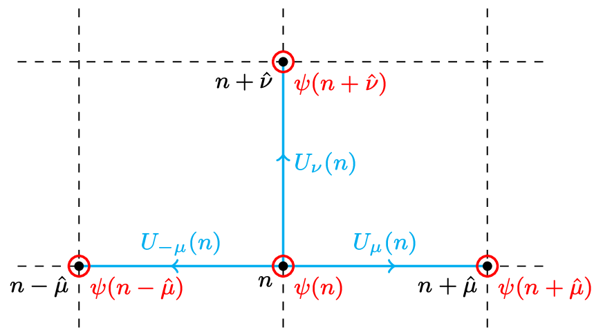

# Covariant Approximation Averaging (CAA): control variates for variance reduction on MCMC data

This repository demonstrates **Covariant Approximation Averaging (CAA)** (see e.g. [Blum et al. (2012)](https://arxiv.org/pdf/1208.4349), [Shintani et al. (2014)](https://arxiv.org/abs/1402.0244)), a **variance-reduction** technique, applied to **real-world Lattice QCD correlator data** from **Markov Chain Monte Carlo (MCMC)** simulations used in my [PhD thesis](http://doi.org/10.5283/epub.76831).

In statistical terms, CAA is a **[control-variates](https://en.wikipedia.org/wiki/Control_variates)** estimator: it pairs a few expensive, high-precision measurements with many cheap, low-precision approximations to cut the variance of an estimate at fixed compute cost. The [closing section](#connection-to-control-variates) makes this connection explicit.

It includes a Jupyter notebook ([view here](https://github.com/spieseba/caa-control-variates/blob/main/covariant_approximation_averaging.ipynb)) with the full analysis and visualizations, built on my [`statpy`](https://github.com/spieseba/statpy) library.

The underlying correlator data is not publicly redistributable; the notebook ships with committed outputs so all results are visible without rerunning.

---

## Results

Applied to real correlator data from a single gauge ensemble, the CAA estimator cuts the statistical error on the vector correlator $C^{(\text{ll})}(t)$ by a factor of **6.5–12.7×** across Euclidean time, at no added cost beyond the cheap solves already being computed:

<p align="center">
  
</p>

An error reduction of $R$ is a **variance** reduction of $R^2$: the precision of $R^2$ times more expensive `exact` configurations. The table below reports the median $R$ and $R^2$ per distance window, measured against the `exact_exact` baseline:

| observable | strategy | window | $t/a$ range | error reduction $R$ | effective statistics $R^2$ |
| --- | --- | --- | --- | --: | --: |
| $C^{(\text{ll})}$ | CAA | SD | $[1, 4]$ | **11.7** | **136** |
| $C^{(\text{ll})}$ | CAA | W | $[5, 11]$ | 8.0 | 64 |
| $C^{(\text{ll})}$ | CAA | LD | $[12, 25]$ | 8.4 | 70 |
| $C^{(\text{lc})}$ | two-stage CAA | SD | $[1, 4]$ | 5.7 | 33 |
| $C^{(\text{lc})}$ | two-stage CAA | W | $[5, 11]$ | 4.8 | 23 |
| $C^{(\text{lc})}$ | two-stage CAA | LD | $[12, 25]$ | 5.2 | 28 |
| $Z(t) = C^{(\text{lc})}/C^{(\text{ll})}$ | full CAA | plateau | $[9, 19]$ | 0.2 | 0.04 |
| $Z(t) = C^{(\text{lc})}/C^{(\text{ll})}$ | matched-source CAA | plateau | $[9, 19]$ | 2.2 | 4.9 |

The improvement is largest in the **short-distance window** (one to two orders of magnitude in effective statistics), which is exactly the region targeted in [arXiv 2410.17053](https://inspirehep.net/literature/2841842). The $Z(t)$ rows are a negative result: averaging numerator and denominator over *different* source positions destroys their correlation and makes the estimator **worse** than the baseline ($R < 1$); keeping the source sets matched restores and exceeds it.

This is a [**control-variates**](https://en.wikipedia.org/wiki/Control_variates) estimator (made explicit in the [closing section](#connection-to-control-variates)), but it departs from the textbook version: the control coefficient is **fixed at $c = 1$** rather than tuned to minimize variance, and the control mean is not known in closed form but estimated cheaply from $N_G$ symmetry copies, leaving a residual $1/N_G$ term in the error.

The [notebook](https://github.com/spieseba/caa-control-variates/blob/main/covariant_approximation_averaging.ipynb) reproduces every number and plot above, including thermalization and autocorrelation checks on the raw MCMC data.

---

## Setup

Prerequisites: Python >= 3.12 and [`uv`](https://docs.astral.sh/uv/getting-started/).

The analysis is built on [`statpy`](https://github.com/spieseba/statpy), which is not published on PyPI. Clone it to a path of your choice and register that checkout as a dependency:

```bash
git clone https://github.com/spieseba/statpy /path/to/statpy
git clone https://github.com/spieseba/caa-control-variates
cd caa-control-variates
uv add /path/to/statpy   # points the statpy dependency at your local clone and installs everything
```

`uv add` records the path in your own copy of `pyproject.toml`, so it is intentionally not committed and each clone can point `statpy` wherever you keep it. The `9a` correlator data is not redistributable, so re-running the notebook is not required: it ships with its outputs committed, and all results above are visible without it.

---

The remainder of this README gives a brief introduction to Lattice QCD and the CAA technique.

---

## Basics of Lattice QCD
Lattice quantum chromodynamics (QCD) is the standard non-perturbative framework for studying the strong nuclear force. In this section, we briefly introduce the essential ingredients, focusing on aspects relevant to simulation and data analysis.

It is defined on a discretized Euclidean spacetime lattice with spacing $a$. The mathematical guiding principle for constructing the action of such a theory is to require gauge invariance under local SU(3) transformations. The Lattice QCD action is:

$$S[\psi,\overline{\psi},U] = S_F[\psi,\overline{\psi},U] + S_G[U]$$
- $S_F$: fermionic part, encoding (anti-)quark fields $\psi, \overline{\psi}$
- $S_G$: gluonic part, governing the gauge fields $U$ (gluons)

The fermionic fields live on **lattice sites**, while the gluonic fields are defined on the **links** connecting them:

<p align="center">
  
</p>

### Path Integral Formulation

Physical observables are computed as **path integrals** over gauge fields $U$:

$$ \langle O \rangle = \frac{1}{Z}\int\mathcal{D}[U] O[U] e^{-S_G[U]}\prod_f\det[D_f],$$

where:
- $O[U]$ is a parametrization of the observable in terms of gauge fields
- $\det[D_f]$ arises from integrating out fermionic degrees of freedom
- $Z$ is the normalization constant (partition function):

$$ Z = \int \mathcal{D}[\psi,\overline{\psi}] \mathcal{D}[U] \, e^{-S[\psi,\overline{\psi},U]} $$

These integrals are evaluated **numerically** using MCMC methods. A set of $N_\text{conf}$ gauge field configurations $U_1, \dots, U_{N_\text{conf}}$ is sampled from the probability distribution:

$$ P[U] \propto e^{-S_G[U]} \prod_f \det[D_f] $$

and the observable is estimated as the **ensemble average**:

$$
  \langle O \rangle = \frac{1}{N_\text{conf}}\sum_{i=1}^{N_\text{conf}} O[U_i] + \mathcal{O}\left(\frac{1}{\sqrt{N_\text{conf}}}\right),
$$

where the error scales with $1/\sqrt{N_\text{conf}}$ due to the central limit theorem and $N_\text{conf}$ is typically of the order 100 - 1000.

---

## Correlation Functions
An especially important class of observables in Lattice QCD are **two-point correlation functions**. They quantify how strongly **quantum fluctuations** at two spacetime points are correlated. Physically, they represent the amplitude to **create a hadron** at one spacetime point and **annihilate it** at another. From their behavior, we can extract key properties of **hadrons**, particles composed of quarks, such as their **masses** and **decay constants**.

Mathematically, two-point correlation functions decay **exponentially** with increasing Euclidean time separation $t$:

$$ 
C(t) \sim e^{- t m_H} \left(1 + \mathcal{O}(e^{-t \Delta E})\right), 
$$

where:
- $m_H$ is the ground state mass of the hadron $H$
- $\Delta E$ denotes the energy gap to the first excited state

At sufficiently large time separations, the excited-state contributions are suppressed, and the **ground state dominates**. This enables the extraction of $m_H$, typically via exponential fits to the correlator.

---

## Computational challenge
Both the **generation of gauge field configurations** and the **computation of correlation functions** in Lattice QCD are computationally intensive tasks.

The primary bottleneck in both steps is the inversion of the **Dirac operator** $D_f$, a large, sparse matrix that encodes the dynamics of a given quark flavor $f$. Its dimension scales with the lattice volume $|\Lambda|$ and internal degrees of freedom:

$$
\text{dim}(D_f) = |\Lambda| \times 12 \quad \text{(3 colors × 4 spins)}
$$

### Cost 1: Gauge Field Generation
To generate **independent gauge field configurations**, one must sample gauge field configuration from the correct probability distribution, which includes the **fermionic determinant** $\det D_f$. 
This is usually achieved using algorithms such as the Hybrid Monte Carlo algorithm (proposed by [Duane et. al (1987)](https://doi.org/10.1016/0370-2693(87)91197-X)) which requires **repeated inversions** of the Hermitian operator $D_f^\dagger D_f$ and is therefore extremely expensive.


### Cost 2: Correlation Function Evaluation
Once configurations are available, computing hadronic correlation functions requires solving large linear systems of the form:

$$
D_f \psi = \eta.
$$

Here, $\eta$ is referred to as a source vector, often chosen to be localized in spacetime (e.g., a delta function). These systems are typically solved using **iterative methods**, such as **Conjugate Gradient (CG)** ([Hestenes & Stiefel (1952)](https://doi.org/10.6028%2Fjres.049.044)) for Hermitian $D_f$ or **BiCGStab** ([Van der Vorst (1992)](https://doi.org/10.1137%2F0913035)) in the non-Hermitian case.

The solution $\psi = D_f^{-1} \eta$ corresponds to a quark propagator from the source $\eta$. The full object $D_f^{-1}$ is called the **quark propagator**, as it represents the inverse of the Dirac operator and encodes quark propagation between any two spacetime points. By forming appropriate combinations of such propagator solutions, one constructs two-point correlation functions $C(t)$ for different hadronic states.

To reduce statistical noise in correlation functions, propagators must be computed from **multiple source positions** on each configuration. Since each solve is expensive, this cost can scale up quickly, making efficient use of computational resources essential.

### Hardware Requirements

These computations typically require the usage of **supercomputers** such as [JUWELS](https://www.fz-juelich.de/en/ias/jsc/systems/supercomputers/juwels) at the Jülich Supercomputing Centre. Optimizing resource usage is therefore crucial: both in terms of **computational time** and **scientific throughput**.

This motivates the use of variance-reduction techniques like **CAA**, which aim to obtain more statistical precision **per unit of compute time**.

---

## Covariant Approximation Averaging (CAA)

To reduce the computational cost of evaluating observables like hadronic correlators, one can construct **improved estimators** that achieve lower statistical errors **without proportionally increasing computational effort**.

**CAA** is one such method, originally proposed by [Blum et al. (2012)](https://arxiv.org/pdf/1208.4349) and later extended in works such as [Shintani et al. (2014)](https://arxiv.org/abs/1402.0244). The key idea is to combine a small number of computationally expensive, high-precision measurements with a larger number of cheaper, low-precision approximations. This method is sometimes also referred to as **All-mode-averaging (AMA)**.

Consider a primary observable $O$. We construct an approximation $O^\text{(appx)}$ that must satisfy the following criteria:

1. **High correlation** with the true observable:

$$
  r = \text{Corr}(O, O^\text{(appx)}) = \frac{\langle \Delta O \Delta O^\text{(appx)} \rangle}{\sqrt{\langle (\Delta O)^2 \rangle \langle (\Delta O^\text{(appx)})^2 \rangle}} \approx 1,
$$

with $\langle (\Delta O)^2 \rangle \approx \langle (\Delta O^\text{(appx)})^2 \rangle$, and $\Delta X = X - \langle X \rangle$. 

2. **Reduced computational cost**:  
   The approximation should be significantly cheaper to compute than $O$.

3. **Covariance under symmetry transformations**:  
   The expectation value $\langle O \rangle$ is **covariant** under a lattice symmetry transformation $g \in G$. We abbreviate: $\langle O^\text{(appx)}[U^g] \rangle = \langle O^{\text{(appx)},g}[U] \rangle$.

### Improved Estimator

Given these criteria, we construct the **improved estimator**:

$$
  O^\text{(imp)} = O^\text{(rest)} + O_G^\text{(appx)},
$$

where:
- $O^\text{(rest)} = O - O^\text{(appx)}$ is a bias correction
- $O_G^\text{(appx)} = \frac{1}{N_G} \sum_{g \in G} O^{\text{(appx)},g}$ is an average over $N_G$ symmetry transformations.

If condition (1.) is fulfilled, then it can be shown that the statistical error of $\langle O^\text{(imp)} \rangle$ is given by:

$$
  \text{err}_\text{imp} \approx \text{err} \sqrt{2(1-r) + \frac{1}{N_G}},
$$

where $\text{err}$ is the standard error of the original estimator.

- The term $2(1 - r)$ is suppressed when the approximation closely tracks $O$, i.e., $r \approx 1$,
- The $1/N_G$ term decreases as more low-cost approximations are averaged.

Condition (3) implies that the improved estimator is **unbiased**:

$$
\langle O^{\text{(rest)}} \rangle + \langle O_G^{\text{(appx)}} \rangle = \langle O \rangle.
$$

As discussed above, computing hadronic correlation functions precisely involves solving large linear systems, which is computationally costly. A natural low-cost approximation is to use low-precision solves (e.g., truncated CG) for the quark propagator. Such a solve carries a systematic error, but CAA never relies on its accuracy: the same procedure is used everywhere, and translational invariance makes its mean independent of the source position. The sloppy term in $O^\text{(rest)}$ and the one averaged in $O_G^\text{(appx)}$ therefore share the same mean, so the systematic error cancels and the estimator stays unbiased. The approximation only has to be strongly correlated with $O$, which is what reduces the variance.

In terms of cost, an error reduction by a factor $R$ is a variance reduction by $R^2$, i.e. the precision of $R^2$ times more gauge configurations. This is a statistical gain: the realized compute saving is smaller, since the improved estimator still performs the cheap sloppy solves, and approaches $R^2$ only when gauge-field generation dominates the cost (which is usually the case for dynamical simulations).

---

## Connection to control variates

CAA is a physics-specific instance of [**control variates**](https://en.wikipedia.org/wiki/Control_variates), a general variance-reduction technique used throughout statistics and Monte Carlo estimation.

The control-variates estimator for a target quantity $X$ introduces a second variable $Y$ that is correlated with $X$ and whose mean $\langle Y \rangle$ is known:

$$ X^\star = X - c \ (Y - \langle Y \rangle). $$

This is unbiased for any coefficient $c$, since $\langle X^\star \rangle = \langle X \rangle$, and its variance is reduced when $X$ and $Y$ are strongly correlated.

CAA is exactly this construction, with the identifications:

| control variates | CAA |
| --- | --- |
| target $X$ | expensive observable $O$ |
| control variate $Y$ | cheap approximation $O^\text{(appx)}$ (same source positions as $O$) |
| known mean $\langle Y \rangle$ | cheaply estimated $O_G^\text{(appx)}$ (averaged over the symmetry orbit) |
| coefficient $c$ | $1$ |

Substituting these into $X^\star$ gives

$$ O - (O^\text{(appx)} - O_G^\text{(appx)}) = O^\text{(rest)} + O_G^\text{(appx)} = O^\text{(imp)}, $$

which is exactly the improved estimator above. The variance drops precisely when $O$ and $O^\text{(appx)}$ are strongly correlated ($r \approx 1$), matching condition (1).

Two details are specific to CAA. The coefficient is fixed at $c = 1$ rather than tuned to minimize variance, and the control mean $\langle Y \rangle$ is not known in closed form: it is estimated cheaply as $O_G^\text{(appx)}$ from $N_G$ symmetry copies, and the residual variance of that estimate is exactly the $1/N_G$ term in the error formula above (it vanishes as $N_G \to \infty$, recovering textbook control variates). The same telescoping structure underlies [**multilevel Monte Carlo**](https://en.wikipedia.org/wiki/Multilevel_Monte_Carlo_method) estimators.
